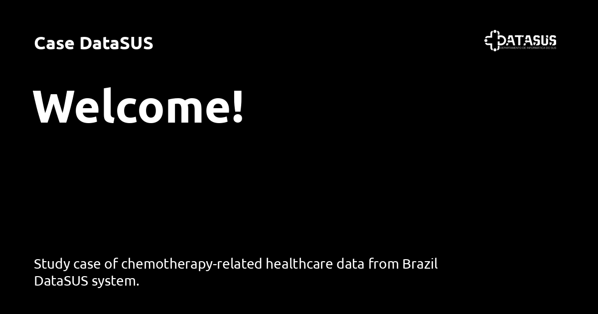

# Case DataSUS

### Read the Docs

> [!NOTE]
> Check out the [full documentation](https://barreiro-r.github.io/case-datasus) for data sources, methodology, analysis and dashboard walkthrough.

In this project, I explore patterns of access, cost, and clinical care across Brazil’s public health system using official data from DATASUS. The analysis focuses on high-complexity outpatient and inpatient treatments, including chemotherapy, immunotherapy, mental health medications, and hospital mortality.

I worked primarily with the following datasets outpatient chemotherapy procedures (SIA:APAC-AQ), high-cost medication authorizations (SIA:APAC-AM) and hospital admissions (SIH:AIH-RD)

These were integrated with external sources such as SIGTAP procedure tables, CID-10 groupings, and municipality codes to enrich the analysis. Data was processed via custom Python ETL pipelines and visualized using Tableau dashboards. The project aims to surface insights on healthcare delivery while ensuring transparency, reproducibility, and a bit of analytical curiosity.

### 🚀 Key Highlights

-  **Antipsychotic & Immunotherapy Use.** Mapped the use of specific high-cost drugs across mental health and immunological treatments using APAC-AM, grouped by diagnosis and procedure codes from SIGTAP.

-  **HER2+ Breast Cancer Treatment.** Tracked chemotherapy procedures related to HER2-targeted therapies using APAC-AQ, focusing on treatment access and coding consistency in oncology.

-  **Hospital Mortality Patterns.** Applied Kaplan–Meier survival analysis on SIH-AIH-RD data to examine sex-based differences in mortality across selected conditions.

-  **Interactive Dashboards.** Developed two Tableau dashboards (one for APAC-AQ, one for APAC-AM) to support exploratory navigation by treatment type, region, and procedure group.

-  **Documentation & Structure.** Organized using a Cookiecutter Data Science–inspired layout. Includes data dictionaries, supplementary tables, and clear ETL notebooks to promote reproducibility and collaboration.

