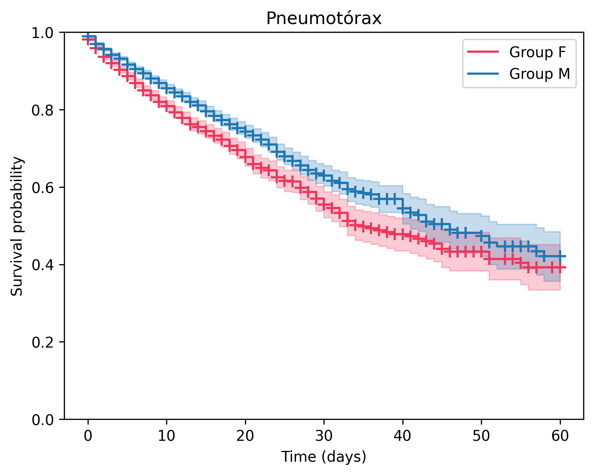
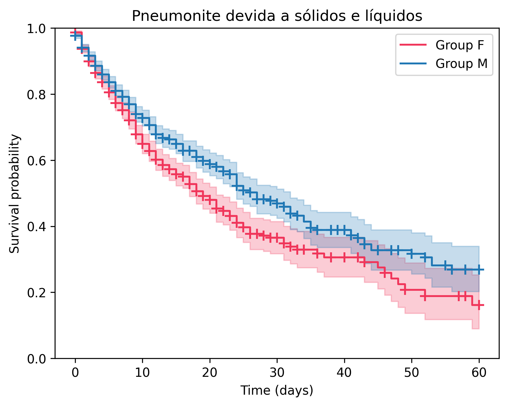
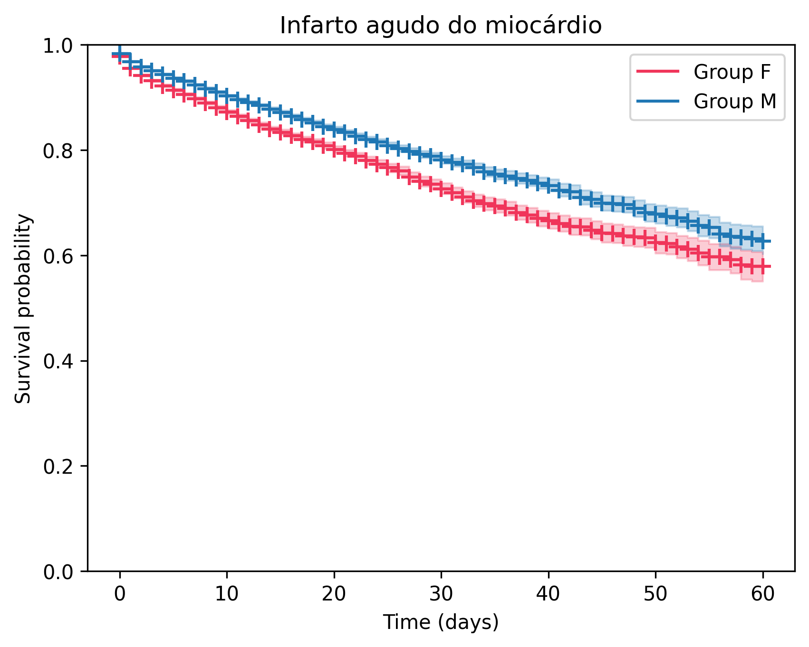
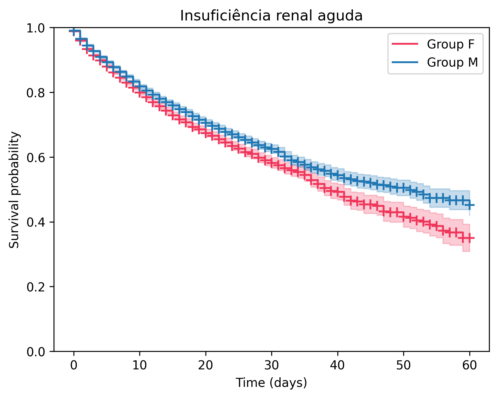
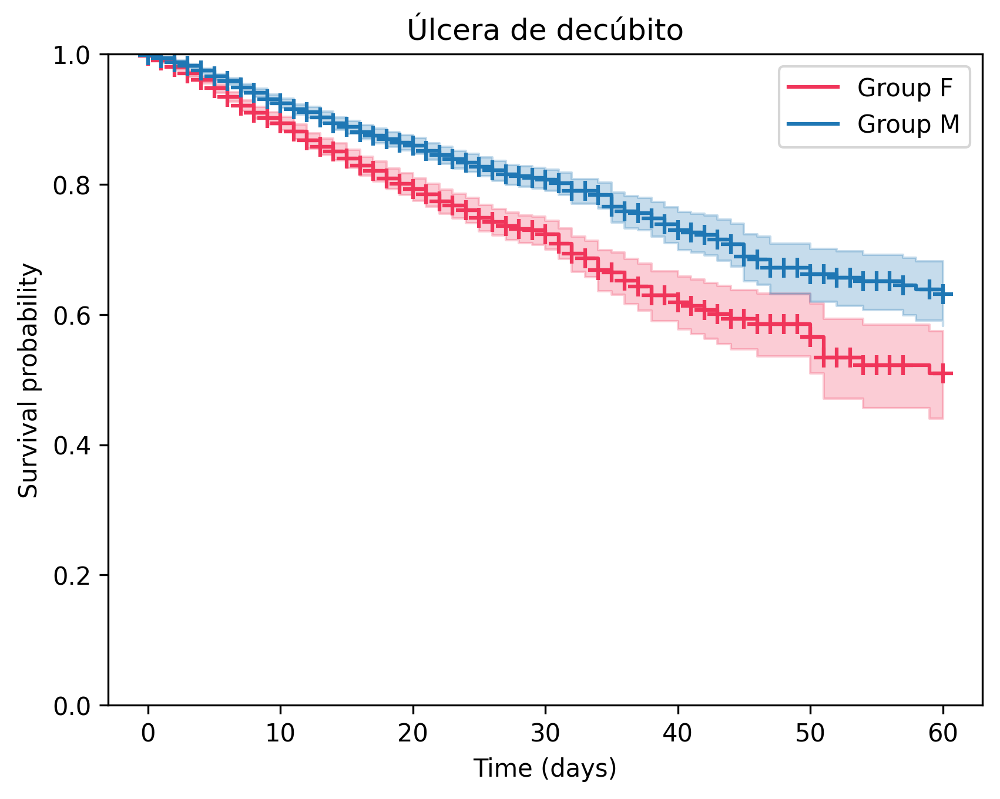
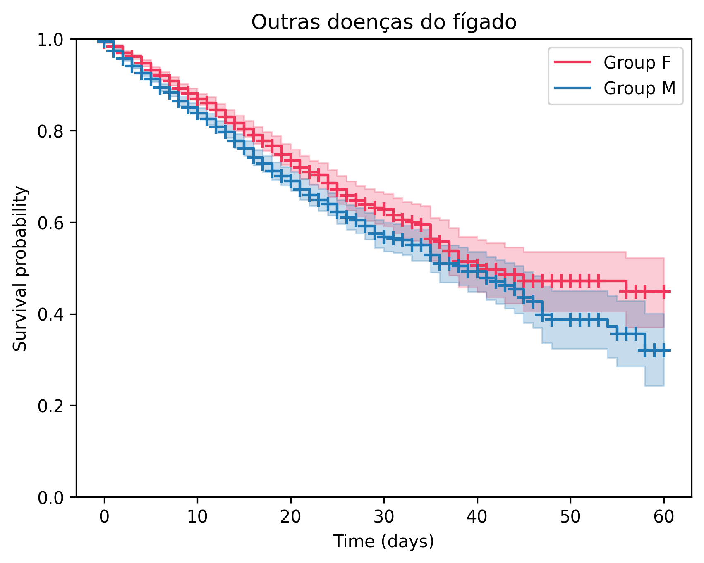
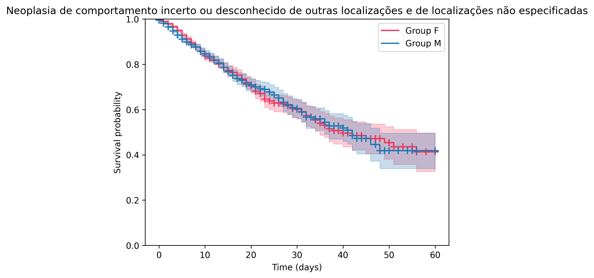
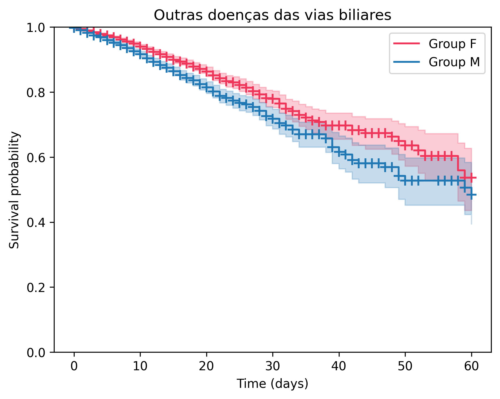
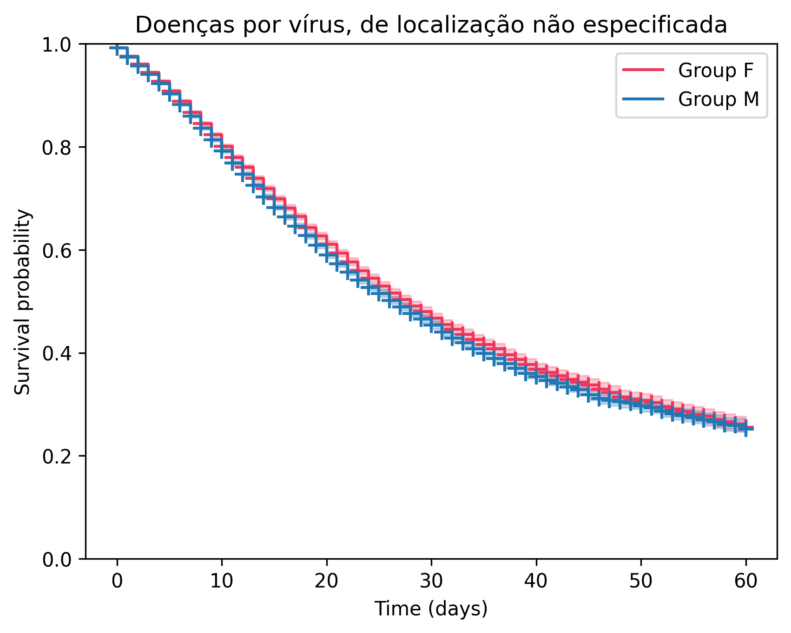

Survival Analysis
=============================================

!!! note ""

    [:octicons-repo-24:  View code on notebook](https://github.com/barreiro-r/case-datasus/blob/main/notebooks/008-rb-survival_analysis.ipynb)

Survival analysis is a statistical approach used to examine the time until an event occurs, such as death or hospital discharge. The Kaplan–Meier estimator is a common method for estimating survival probabilities and comparing groups over time, especially when dealing with censored data.

This report uses Kaplan–Meier curves to analyze mortality related to specific diseases recorded in the Brazilian Unified Health System (SUS) database. The goal is to identify differences in survival across conditions and patient groups, providing a descriptive view of how mortality varies within the SUS context.

## :octicons-database-24: Data 

The data used in this analysis is sourced from the SIH: AIH-RD.

## :octicons-project-roadmap-24: Objectives

1. Determine the CID with the most disparate mortality rates between males and females (percent of hospitalization).
2. Filter the data to include only the selected CID.
3. Generate a Kaplan-Meier curve stratified by gender.

## :octicons-beaker-24: Results

CID with most disparate mortality rates between males and females:

| CID10                                     | %&nbsp;Mortality&nbsp;F | %&nbsp;Mortality&nbsp;M | Δ&nbsp;%&nbsp;Mortality |
| ------------------------------------------ | -----------: | -----------: | ----------------: |
| Pneumotórax                                |      **18.78%** |      13.27% |             5.51% |
| Pneumonite devida a sólidos e líquidos     |      **34.63%** |      29.40% |             5.23% |
| Neoplasia de comportamento incerto ou desconhecido |       4.85% |       **9.13%** |             4.28% |
| Úlcera de decúbito                          |      **12.11%** |       8.22% |             3.89% |
| Outras doenças do fígado                   |      12.00% |      **14.99%** |             2.99% |
| Infarto agudo do miocárdio                 |      **10.80%** |       7.97% |             2.83% |
| Choque não classificado em outra parte     |      67.51% |      **70.25%** |             2.74% |
| Insuficiência renal aguda                  |      **20.07%** |      17.49% |             2.58% |
| Outras doenças das vias biliares            |       5.17% |       **7.71%** |             2.54% |
| Doenças por vírus, de localização não especificada |      17.31% |      **19.78%** |             2.47% |

### Higher Mortality in Females

=== "Pneumotórax"

    

=== "Pneumonite"

    

=== "Infarto"

    

=== "Insuficiência renal aguda"

    

### Higher Mortality in Males

=== "Úlcera"

    

=== "Outras doenças do fígado"

    

=== "Neoplasia incerta"

    

=== "Choque"

    

=== "Vias biliares"

    

=== "Doenças por vírus"

    

## :octicons-comment-discussion-24: Brief Discussion

This analysis employed Kaplan–Meier survival estimates to explore differences in mortality associated with selected diseases using data from the AIH-RD database.

To ensure comparability between sexes, gender-specific conditions,such as breast and prostate cancer,were excluded from the analysis.

While several diseases demonstrated differing mortality rates between male and female patients, the absolute differences in survival probabilities were relatively modest. It is important to note that the interpretation of these differences may be influenced by potential confounding factors. In particular, the absence of age adjustment introduces a possible survival bias, especially in the female cohort, where longer life expectancy could affect observed survival patterns.

Further analyses controlling for age and other relevant covariates would be necessary to clarify the extent to which the observed differences are attributable to biological, behavioral, or healthcare-related factors.